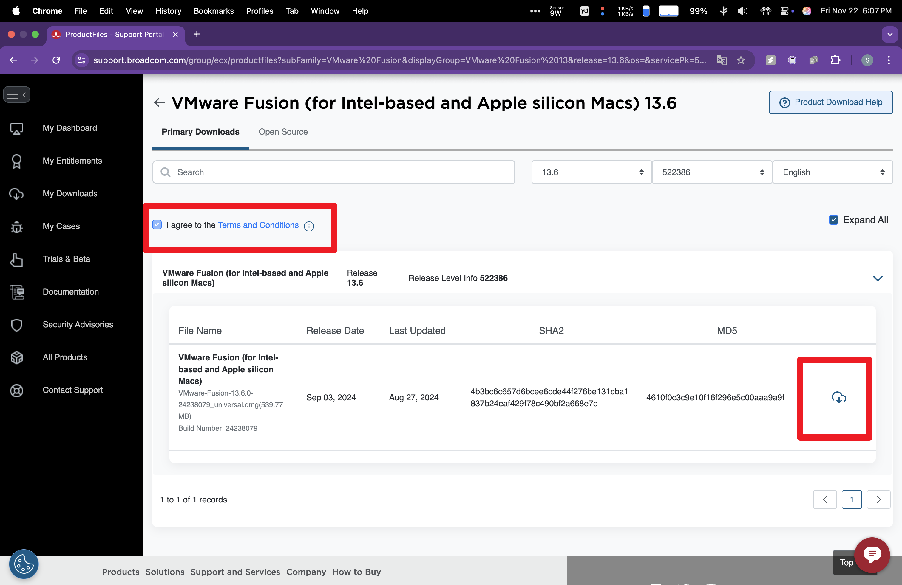
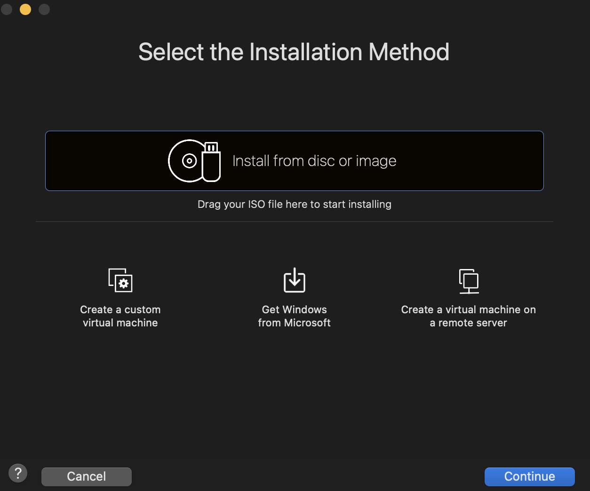

In this detailed tutorial for NYU's CSGY6233 Operating Systems course, I'll guide you through each step of installing VMware on a Mac system. Whether you're just starting out in virtualization or you're a seasoned user looking to optimize your setup, this guide is designed to facilitate a seamless installation process. By the conclusion of this tutorial, you'll be adept at leveraging the capabilities of VMware on your Mac.

## 0. Prerequisite
VMware Workstation requires a 64-bit processor and a 64-bit host operating system. Additionally, this tutorial is specifically for Macs with M1, M2, or M3 chips.


## 1. Download VMware Fusion & Ubuntu ISO
VMware provides VMware Fusion for non-commercial use, offering an excellent opportunity if you're interested in exploring its features without any financial commitments. This option is ideal for users looking to get acquainted with virtualization on Mac systems.

### 1.1 Visit the Official VMware Website & Register an Account & Download VMware Fusion:
1. Go to broadcom.com
2. In the upper right corner, select 'Support Portal'
3. Either log in by clicking 'Go To Portal' or 'Register' for a basic Broadcom account Quick link to the registration form
4. Once logged in, go to support.broadcom.com if you're not redirected there
5. Find My Downloads in the Software Dropdown list

6. Search for VMware Fusion in Downloads
 
7. Select the lastest version

8. Agree on Terms and download 


### 1.2 Download Arm Ubuntu ISO

Due to Ubuntu's official website only offering the server version of the ISO, which is a headless version, it poses a significant inconvenience for us. Manually installing the desktop version is not very practical. Therefore, I am providing my [Google Drive](https://drive.google.com/file/d/1drPXQ-u4b1U6T1xi6etVWucGWLN1Qdha/view?usp=drive_link) link where you can access the desktop version. 


## 2. Install VMware

1. Install from disc or image

2. Select the previous downloaded ISO
3. Press Enter & install Ubuntu, 

4. Click the 'install ubuntu' icon on desktop

5. Go through the setup process and restart


## 3. Install Open VM Tool to enable shared clip-board and more!!
1. Update apt, which a 'app store' on Ubuntu
```shell
sudo apt-get update & upgrade
```
2. Install open-vm-tool
```shell
sudo apt-get install open-vm-tools-desktop
```
Now you should be able to copy and paste between host and virtual machine!