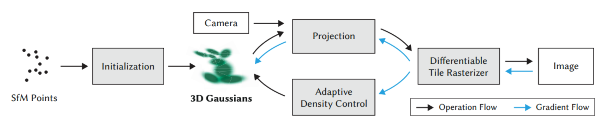
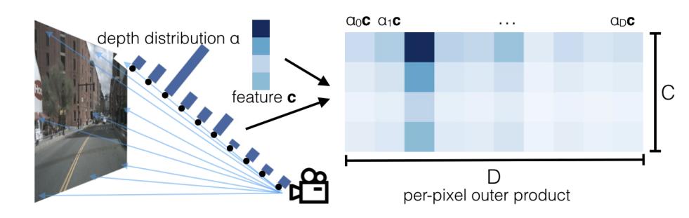
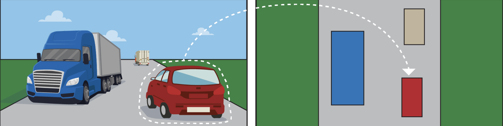
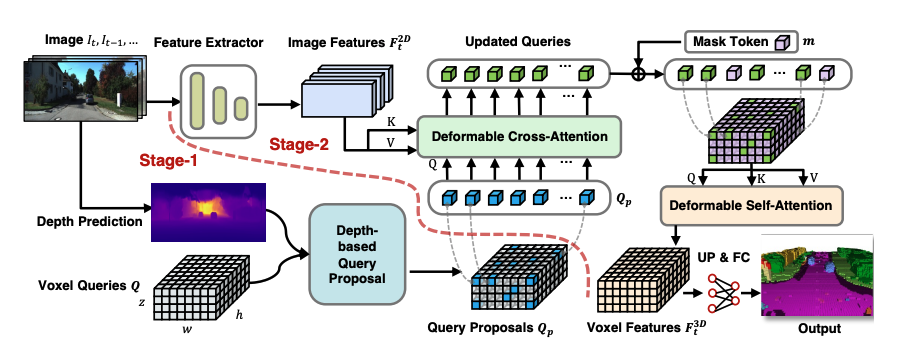
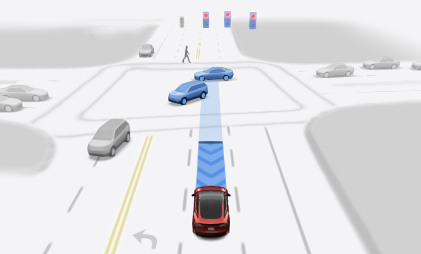
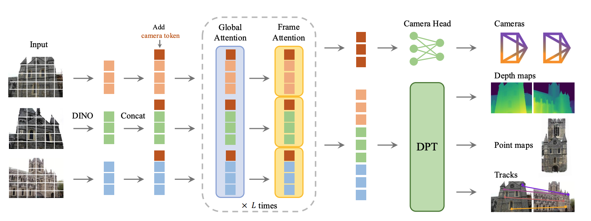
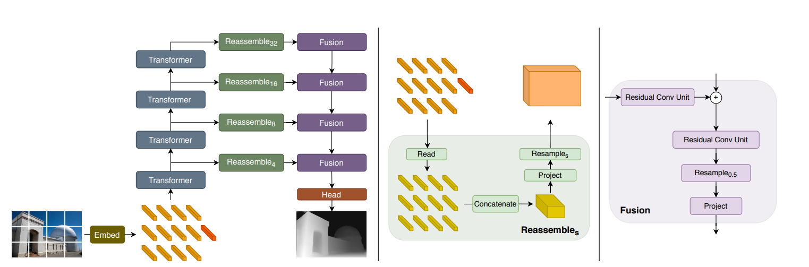

### 1. SFM(Structure From Motion)

1. **Feature Extraction**
   1. Find keypoints:
      1. Scale-Space Construction: blur the image and generate a set of images -> Result: At this point, the computer possesses a "comprehensive set" of images ranging from clear to blurry, and from large to small.
      2. Keypoint Localization: difference of gaussian, extreme detection -> Results: **Blobs** or **Corners**.
2. **Feature Matching**
   1. Descriptor Matching: Calculate feature vectors for each keypoint, compare them across images, and remove outliers using geometric constraints (RANSAC).-> Result: Verified Correspondences (pairs of points linking Image A to Image B).
3. **Sparse Reconstruction**
   1. Triangulation & Optimization: Project 2D matches back into 3D space (Triangulation) and refine via Bundle Adjustment.
      

### 2. NeRF (Neural Radiance Fields)

  

1. **Ray Sampling**  
   For every pixel, NeRF casts a ray into the scene and samples a set of 3D points along the ray.

2. **A Model to Predict Density and Color**  
   The core of NeRF is an MLP that maps each sampled 3D point (plus viewing direction) to:

   - σ (density)
   - RGB color

   This allows NeRF to represent both geometry and appearance.

3. **Volume Rendering**  
   NeRF integrates colors and densities using a volume rendering equation to compute the final pixel color.  
   Points with higher density occlude points behind them, and contributions are accumulated along the ray.

### 3. Gaussian

1. **Initialization**

   Start with a sparse point cloud generated via SFM (Structure from Motion). These points serve as the initial means (positions) for the 3D Gaussians.

2. **Gaussian Representation: Geometry (Position & Shape)**

   Each point is represented as a 3D anisotropic Gaussian (an ellipsoid). To make this differentiable and valid, the covariance matrix $\Sigma$ (which defines shape) is decomposed into:Scaling ($S$): How much to stretch the ellipsoid along 3 axes.Rotation ($R$): Represented by a quaternion to define orientation.

3. **Gaussian Representation: Appearance (Color & Opacity)**

   To capture realistic visuals, each Gaussian carries:Opacity ($\alpha$): How transparent or solid the ellipsoid is.Spherical Harmonics (SH): Coefficients that represent view-dependent color (allowing for shiny surfaces and lighting effects that change as you move the camera).

4. **Differentiable Rasterization**

   a fast rasterization approach:

   - Projection: 3D Gaussians are projected into 2D screen space (becoming 2D splats).
   - Sorting: Splats are sorted by depth (front-to-back) using a fast GPU Radix sort.
   - Alpha Blending: The sorted splats are composited to form the final image.
  

### 4. LSS

1. **Lift**  
    Each pixel feature corresponds to a 3D ray.  
    LSS predicts a probability distribution over depth bins for every pixel.  
    Then each pixel is lifted into multiple possible 3D positions using camera intrinsics/extrinsics.
   
2. **Splat**  
   All lifted 3D features are projected (“splatted”) onto a 2D BEV(bird's eye view) ground.  
   Features falling into the same BEV cell are aggregated, producing a BEV feature map.

3. **Shoot**  
    Once BEV features are obtained, it could be feed into diffrent heads for different downstream tasks:
   - 3D object detection
   - BEV segmentation
   - Road layout prediction, etc.
       
     

### 5. Occupancy Prediction

### 6. End2End: VGGT

